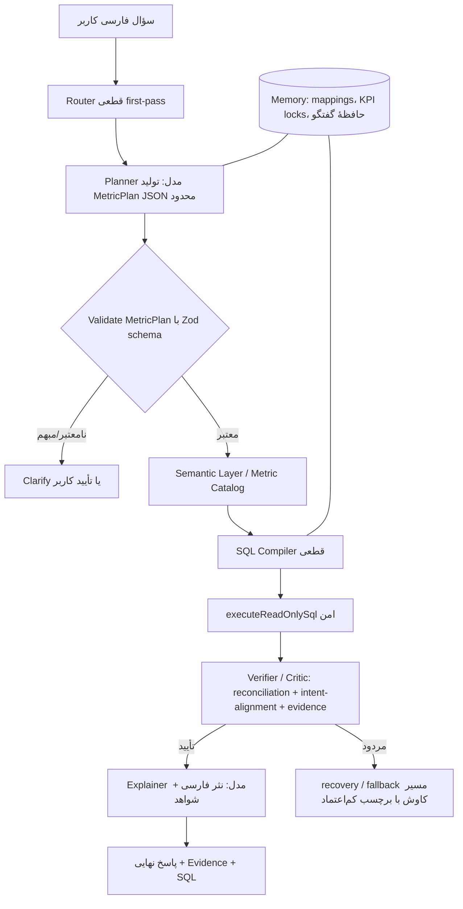

# FRE Roadmap 00 — نمای کلی، معماری و قرارداد کاری
### Financial Reasoning Engine (FRE) — مهاجرت ارکستریتر به «لایهٔ معنایی + کامپایلر قطعی»

> این مجموعه نقشهٔ راهی است که باید به‌صورت قدم‌به‌قدم توسط یک مدلِ پیاده‌سازِ قوی (GPT‑5.3 Codex یا Sonnet 4.5) اجرا شود. این فایل «۰» سند ریشه است: ابتدا کامل خوانده شود، سپس فایل‌های فاز به ترتیب اجرا شوند.

---

## ۰.۱ — هدف یک‌خطی

ارکستریترِ مالی را از الگوی **«مدلِ ضعیف + N هندلرِ دست‌سازِ deterministic»** به الگوی **«مدلِ قوی به‌عنوان Planner/Explainer + یک موتورِ معناییِ واحد که درست‌به‌ساخت است»** تبدیل کنیم — چیزی شبیه حلقهٔ شفافِ Cascade/GitHub Copilot، اما با **تضمینِ عددیِ مالی** (هیچ عددی توهمی تولید نشود).

---

## ۰.۲ — چرا (مسئله‌ای که حل می‌کنیم)

وضعیت فعلی: هر سؤال مالیِ جدید نیازمند یک regexِ روتینگ + یک هندلر TypeScript + build + deploy + field-test است. این یک «تردمیل» است:

- مقیاس‌پذیر نیست (هر KPI و هر عبارت‌بندی، کدِ جدید می‌خواهد).
- شکننده است (دانشِ schema در ۵ هندلر تکرار شده؛ هر اصلاح باید در همه تکرار شود).
- به قدرتِ مدل گره خورده است (راهنماییِ متنی به مدلِ ضعیف، ما را از مسیر خارج می‌کند — درسِ مستندِ SWE‑1.6).

**اصلِ معماریِ هدف:** *هستهٔ قطعی، پوستهٔ احتمالی* (deterministic core, probabilistic shell). مدل هرگز عدد تولید نمی‌کند؛ مدل فقط **برنامه‌ریزی** و **توضیح** می‌کند، و عددها فقط از اجرای SQLِ قطعی و تأییدشده می‌آیند.

---

## ۰.۳ — نمای معماری هدف



### مسئولیتِ لایه‌ها

| لایه | ورودی | خروجی | قطعی؟ |
|---|---|---|---|
| **Router** | متنِ فارسی | کاندیدای metricId + سیگنال‌های اطمینان | بله |
| **Planner** (مدل) | متن + کاتالوگ متریک | `MetricPlan` (JSON محدود) | خیر (اما محدود + اعتبارسنجی‌شده) |
| **Semantic Layer** | — | `MetricDefinition[]` (دادهٔ اعلانی) | بله |
| **Compiler** | `MetricPlan` + `MetricDefinition` + Catalog | رشتهٔ SQLِ امن | بله |
| **Executor** | SQL | ردیف‌ها | بله (read-only policy) |
| **Verifier** | ردیف‌ها + plan | verdict + اعداد تأییدشده | بله |
| **Explainer** (مدل) | اعداد تأییدشده | نثر فارسی + Evidence | خیر (فقط می‌چیند، عدد نمی‌سازد) |

---

## ۰.۴ — نقشهٔ فازها و فایل‌ها

| فاز | فایل | موضوع | اندازه | ریسک منطقی |
|---|---|---|---|---|
| ۱ | `FRE_ROADMAP_01_FOUNDATION_AND_MODULE_SPLIT.fa.md` | شکستنِ ارکستریتر (رفتار-حفظ) + اسکلتِ ماژول‌ها + feature flag | متوسط | پایین |
| ۲–۳ | `FRE_ROADMAP_02_SEMANTIC_LAYER_AND_COMPILER.fa.md` | شِمای MetricDefinition، MetricPlan IR، کامپایلر، مهاجرتِ ۵ متریک | متوسط | پایین–متوسط |
| ۴–۵ | `FRE_ROADMAP_03_PLANNER_AND_VERIFIER.fa.md` | Planner ساختاریافته + Verifier/Critic + ادغامِ evidence | متوسط | پایین |
| ۶ | `FRE_ROADMAP_04_EVAL_DEPLOY_AND_CUTOVER.fa.md` | هارنسِ golden، CI، shadow mode، استقرار، تأیید میدانی، cutover، rollback | کوچک–متوسط | پایین |
| ۷ | `FRE_ROADMAP_05_PHASE7_LEGACY_MIGRATION.fa.md` | مهاجرتِ ۹ intent باقی‌مانده به FRE — هر کدام فقط با تعریف + golden test | متوسط | پایین–متوسط |
| ۸ | `FRE_ROADMAP_06_PHASE8_MULTI_METRIC.fa.md` | MultiMetricPlan، grains واقعی (by_month/by_quarter/by_customer)، متریک‌های مشتق | متوسط | متوسط |
| ۹ | `FRE_ROADMAP_07_PHASE9_PRODUCTION.fa.md` | Shadow run ۲ هفته، حذفِ فیزیکیِ legacy، monitoring، بهینه‌سازی | کوچک–متوسط | پایین |
| ۱۰ | `FRE_ROADMAP_08_PHASE10_PLANNER.fa.md` | Planner مدلی پیشرفته، Clarify هوشمند، زبانِ محاوره‌ای، ۴۰+ golden | متوسط | متوسط |
| ۱۱ | `FRE_ROADMAP_09_PHASE11_SEPIDAR_DEPTH.fa.md` | عمق‌بخشی روی سپیدار: ۱۰۰+ golden cases، صورت‌های مالی استاندارد، نسبت‌های مالی، planner پیچیده | متوسط–بزرگ | متوسط |
| ۱۲ | `FRE_ROADMAP_10_PHASE12_SCHEMA_ABSTRACTION.fa.md` | **جایگزین‌شده با فاز ۱۵** — تمام اهداف (SchemaAdapter, SepidarAdapter, adapter registry) در فاز ۱۵ به‌صورت کامل‌تر پیاده‌سازی شد (automatic discovery + buildAdapter) | — | — |
| ۱۳ | `FRE_ROADMAP_11_PHASE13_ADVANCED_MANAGEMENT.fa.md` | متریک‌های مدیریتی پیشرفته: COGS، موجودی، بودجه، مراکز هزینه، پروژه، خروجی PDF/Excel، نمودار | بزرگ | متوسط |
| ۱۴ | `FRE_ROADMAP_12_PHASE14_ACCOUNTANT_TOOLS.fa.md` | ابزارهای حسابدار: فیلتر محدوده تاریخ، کوئری سند-محور، کشف خطا، تحلیل سنی، گردش تفصیلی، مالیات، چک، بستن دوره، تطبیق، drill-down مکالمه‌ای | بزرگ | متوسط |
| ۱۵ | `FRE_ROADMAP_13_PHASE15_BLIND_SCHEMA_DISCOVERY.fa.md` | کشف کور schema: SchemaAdapter interface، INFORMATION_SCHEMA scan، LLM semantic mapping، human-in-the-loop، مسیر دوگانه (سپیدار + auto-detect) | متوسط–بزرگ | متوسط |
| ۱۶ | `FRE_ROADMAP_14_PHASE16_SSH_REMOTE_CONNECTION.fa.md` | اتصال از راه دور با SSH: auto-connect، auto-reconnect، Connection Wizard، host key verification، credential encryption، health indicator، ادغام با Blind Schema Discovery | متوسط–بزرگ | متوسط |
| ۱۷ | `FRE_ROADMAP_15_PHASE17_ARCH_FIXES.fa.md` | رفع مسائل معماری: backpressure در تونل SSH، بستن pool SQL هنگام قطع تونل، گیت کردن DIAG logs، کش کردن resolveRuntimeSqlConnection، رفع فراخوانی مضاعف eventLogEntries، surfacing خطای autoDiscoverSchema به UI | کوچک–متوسط | پایین |
| ۱۸ | `FRE_ROADMAP_16_PHASE18_PYTHON_SANDBOX.fa.md` | محیط اجرای پایتون embedded: sandbox امن، AST validation، whitelist کتابخانه‌ها، ادغام با Planner (PythonOutputPlan)، رندر نمودار/اکسل/PDF در چت، pip با repo fallback ایرانی | متوسط–بزرگ | متوسط |
| ۱۹ | `FRE_ROADMAP_17_PHASE19_ADVANCED_FINANCIAL_METRICS.fa.md` | متریک‌های مالی پیشرفته: صورت جریان وجوه نقد، نسبت‌های سودآوری (ROE/ROA)، نسبت‌های نقدی و گردش، تحلیل روند و CAGR، دارایی‌های ثابت، بهای تمام‌شده تفصیلی، تطبیق بانک، مالیات پیشرفته | متوسط–بزرگ | متوسط |
| ۲۰ | `FRE_ROADMAP_18_PHASE20_ADVANCED_PLANNER.fa.md` | Planner هوشمند: چندمرحله‌ای (MultiStepPlan)، حافظه مکالمه v2، پیشنهادهای هوشمند (Smart Suggestions)، کشف خودکار anomaly، دانش دامنه حسابداری، Clarify پیشرفته | متوسط–بزرگ | متوسط |
| ۲۱ | `FRE_ROADMAP_19_PHASE21_UX_REPORTING.fa.md` | تجربه کاربری و گزارش‌گیری: شفافیت SQL، اعتماد-score، نمودار تعاملی (Chart.js)، گزارش‌های زمان‌بندی‌شده، پشتیبانی چندزبانه (فارسی+انگلیسی)، chat history persistence، quick actions | متوسط | پایین–متوسط |
| ۲۲ | `FRE_ROADMAP_20_PHASE22_AGENTIC_LOOP.fa.md` | حلقهٔ عامل: ارتقاء Router (وزن‌دهی هوشمند anchor + candidate mode)، ارزیابی نتیجه (Result Evaluation)، حلقهٔ بازیابی هوشمند (Smart Retry)، حل entity چندحسابی (Entity Resolution) | متوسط | متوسط |
| ۲۳ | `FRE_ROADMAP_22_PHASE23_ANTI_HALLUCINATION.fa.md` | بستنِ راهِ توهم: رفع سوراخِ Verifier (intent alignment)، دروازهٔ fail-closed، گارد عددی Explainer، مارکر EVIDENCE_FIRST_ENGINE، بازتولید مستقل ground-truth، بنچ‌مارک عددی live | متوسط | متوسط |
| ۲۵ | `FRE_ROADMAP_23_PHASE25_PARTY_TURNOVER.fa.md` | گردش طرف حساب: resolvePartyByName، party_turnover metric، multi-token entity matching، year-scoped party clarify | متوسط | متوسط |
| ۲۶ | `FRE_ROADMAP_24_PHASE26_INVESTIGATOR_LOOP.fa.md` | حلقهٔ تحقیق‌گر: fallback هنگام عدم تطابق متریک — schema scan، heuristic mapping، probe loop (locate→enumerate→follow_fk)، clusterLedgers، multi-ledger clarify، budget bounded، read-only SQL، SchemaCache | متوسط–بزرگ | متوسط |
| ۲۹ | `FRE_ROADMAP_29_PHASE29_GROUNDTRUTH_SWEEP.fa.md` | سوییپِ ground-truth: اوراکلِ مستقل برای همهٔ متریک‌های اسکالر، رجیستریِ تأیید، verify:registry | متوسط | متوسط |
| ۳۰ | `FRE_ROADMAP_30_PHASE30_ACCOUNTANT_DEEP_VERIFICATION.fa.md` | تأییدِ عمیقِ ابزارهای حسابدار: تطبیق دو منبع (recursive CTE)، ناهنجاری (نمونه‌گیری)، تحلیل سنی (جمع سطل‌ها)، مالیات/چک، جریان وجوه نقد، بستهٔ پذیرشِ حسابدار | متوسط | متوسط |

**ترتیب اجرا:** ۱ → ۲ → ۳ → ۴ → ... → ۱۳ → ۱۴ → ۱۵ → ۱۶ → ۱۷ → ۱۸ → ۱۹ → ۲۰ → ۲۱ → ۲۲ → ۲۳. هیچ فازی قبل از سبزشدنِ کاملِ فاز قبل (تست + typecheck + شواهد) شروع نشود.

---

## ۰.۵ — استراتژی Strangler Fig (بدون big-bang)

هیچ‌چیز یک‌باره بازنویسی نمی‌شود. مهاجرت با یک flagِ سه‌حالته آغاز شد (`legacy` → `shadow` → `engine`)، و در **فاز ۲۴** سوئیچِ سه‌حالته **کاملاً حذف شد**. اکنون:

- **موتورِ نو (engine) تنها ورودی است.** هیچ مسیرِ legacy، هیچ fallback به حلقهٔ مدل+SQL، هیچ shadow comparison باقی نمانده.
- پرسش‌های مالی‌عددی → فقط engine؛ یا عددِ تأییدشده یا **ردِ صریحِ بی‌عدد**.
- پرسش‌های غیرمالی/راهنمایی → مسیرِ متن‌فقط (`answerTextOnly`) با گاردِ عددی — بدونِ SQL.
- فیلدِ `financialEngineMode` از `SettingsStore`، `types.ts`، `contracts.ts`، و UI حذف شد. متغیرِ `ACC_FINANCIAL_ENGINE_MODE` هم برداشته شد.

هر متریک **به‌صورت جداگانه** و پشتِ این flag مهاجرت کرد. هندلرِ قدیمی پس از اثباتِ تطابقِ عددی (shadow سبز) بازنشسته شد. در فاز ۲۴، حذفِ فیزیکیِ کاملِ legacy انجام شد.

---

## ۰.۶ — قرارداد کاری اجباری (Working Agreement)

> این بخش از تجربهٔ مستندِ پروژه استخراج شده و **نقض‌ناپذیر** است. مدلِ پیاده‌ساز باید به همهٔ این قواعد پایبند بماند.

### قانون ضدِ تیکِ بی‌شاهد (Anti-over-ticking)
- هیچ آیتمی `[x]` نشود مگر با **شاهدِ واقعی**: خروجیِ تست، یا خطِ `final` از `agent-audit.log` با `requestId`.
- **هرگز** «Cannot answer reliably» یا یک پاسخِ رد را به‌عنوان موفقیت تیک نزن.
- اگر کاری ناقص ماند، صادقانه `[ ]` بگذار و دلیل + یافته را بنویس.

### دستورهای تأییدشده (Windows / PowerShell)
```powershell
# Typecheck
npm run typecheck:node            # = tsc --noEmit -p tsconfig.node.json --composite false

# Test (الزاماً با --test-force-exit)
npx tsx --test --test-force-exit tests/unit/*.test.ts tests/integration/*.test.ts 2>&1 `
  | Select-String -Pattern "tests |pass |fail |skipped " | Select-Object -Last 5
# baseline فعلی = 244 tests / 243 pass / 0 fail / 1 skipped — نباید قرمز شود

# Build (چند دقیقه؛ خروجیِ امضاشده)
npm run build:win                 # → dist\win-unpacked\ACCAssist.exe + dist\acc-assist-1.0.0-setup.exe

# Deploy (env باید در همان شل ست باشد)
$env:ACC_REMOTE_HOST='192.168.85.56'; $env:ACC_REMOTE_USER='administrator'
$env:ACC_REMOTE_SSH_PASSWORD='<در شل ست شده>'
$env:ACC_REMOTE_HOST_KEY='ssh-ed25519 255 SHA256:sEP9p+Bs2vmC7FrAS/CjaodoZVs9LyB2ro4fELRt+iQ'
npm run remote:install ; npm run remote:start
```

### تأییدِ استقرار (asar-grep) — اجباری بعد از هر deploy
هرگز فرض نکن بیلد مستقر شده. نشانگرِ کدِ نو را در asarِ مستقرشده بشمار:
```powershell
$ps='(Select-String -Path "C:\Users\Administrator\AppData\Local\Programs\acc-assist\resources\app.asar" -Pattern "<MARKER>" -AllMatches | Measure-Object).Count'
$b64=[Convert]::ToBase64String([Text.Encoding]::Unicode.GetBytes($ps))
plink -P 2211 -ssh -batch -hostkey $env:ACC_REMOTE_HOST_KEY -pw $env:ACC_REMOTE_SSH_PASSWORD administrator@192.168.85.56 "powershell -NoProfile -EncodedCommand $b64"
```

### تستِ میدانی (ask-ai) — پرامپت کوتاه + DebugToken ثابت
```powershell
chcp 65001 > $null; [Console]::OutputEncoding=[Text.Encoding]::UTF8; $OutputEncoding=[Text.Encoding]::UTF8
Set-Content -Path "$PWD\tmp-q.txt" -Value 'مقایسه فروش ۱۴۰۲ و ۱۴۰۳' -Encoding utf8 -NoNewline
pwsh -ExecutionPolicy Bypass -File scripts/ops/remote-server-control.ps1 -Action ask-ai `
  -PromptFile "$PWD\tmp-q.txt" -ConversationId 'fre1' -DebugToken 'fretok'
# خروجی: Ok / Rounds / ToolCallsUsed / ---FINAL TEXT---
```

### شاهدِ audit-log
مسیر روی ریموت: `C:\Users\Administrator\AppData\Roaming\acc-assist\logs\agent-audit.log` (هر خط JSON).
خطِ `final`ِ تمیزِ deterministic: `round:0` و بدونِ `failureKind`. خطای ابزار: `{"stage":"tool-error","errorCategory":"deterministic-tool-failure",...}`.

### تشخیصِ ground-truth با sqlcmd
```powershell
# کاربر/رمز دموی واقعیِ تست‌DB
sqlcmd -S 127.0.0.1,58033 -U damavand -P damavand -d Sepidar01 -h -1 -W -Q "SET NOCOUNT ON; <query>"
# لیترال‌های فارسی را به‌صورت NCHAR(...) بنویس تا کامند ASCII-safe بماند (بدون mojibake)
```

---

## ۰.۷ — داده‌های Ground-Truth (لنگرهای رگرسیون)

این اعداد روی محیطِ تست (Sepidar01 @ 192.168.85.56) تأیید میدانی شده‌اند و باید به‌عنوان **اوراکلِ تست** در golden ها قفل شوند:

| متریک | پرسش | عددِ مرجع |
|---|---|---|
| تراز آزمایشی ۱۴۰۲ | `get_trial_balance` (SUM(Debit), VoucherItem JOIN Voucher JOIN Account JOIN FiscalYear, Type NOT IN(3,4)) | `566,396,483,280` |
| نقد + بانک | `get_cash_bank_balance` | `9,521,507,066` (نقد `2,127,900,602` + بانک `7,393,606,464`) |
| خرید ۱۴۰۲ | `INV.InventoryReceipt` `IsReturn=0` | `226,110,419,451` |
| فروش ۱۴۰۲ | `SLS.Invoice` net | `64,252,437,897` |
| فروش ۱۴۰۳ | `SLS.Invoice` net | `57,023,796,065` |
| مقایسهٔ فروش ۱۴۰۲→۱۴۰۳ | درصد | `-11.25%` (دقیق: `-11.2504%`) |
| ماندهٔ دریافتنی ۱۴۰۲ | `ACC.VoucherItem` `Type NOT IN(3,4)` | `19,755,458,505` |

### Schemaِ تأییدشده (Sepidar)

```
SLS.Invoice         : net = NetPriceInBaseCurrency ; FiscalYearRef (FK) ; Date
FMK.FiscalYear      : FiscalYearId (PK int) ; Title (nvarchar، سالِ واقعی مثل '1402')
ACC.Voucher         : VoucherId (PK) ; Type (int) ; FiscalYearRef ; Date ; Description
ACC.VoucherItem     : VoucherRef→ACC.Voucher.VoucherId ; AccountSLRef→ACC.Account.AccountId ;
                      Debit ; Credit   (تنها ستون‌های ارجاعِ حساب: AccountSLRef؛ AccountRef وجود ندارد)
ACC.Account         : AccountId (PK) ; Title (نام، با کاراکترهای عربی)
INV.InventoryReceipt: TotalPrice ; IsReturn (0=غیرمرجوعی)
RPA.CashBalance     : Balance
RPA.BankAccountBalance : Balance
POM.PurchaseInvoice : خالی (0 ردیف) — خرید واقعی در INV.InventoryReceipt است
```

### قواعدِ طلاییِ schema (که باید قواعدِ کامپایلر شوند)
- **R-سال:** فیلترِ سال **همیشه** با `JOIN FMK.FiscalYear ON <ref>=FiscalYearId WHERE Title IN (...)`. هرگز `CAST(FiscalYearRef AS int)=1402` (کلیدِ جانشین است، ۰ ردیف).
- **R-اختتامیه:** برای ماندهٔ مبتنی بر سند، **همیشه** `AND v.Type NOT IN (3, 4)` (وگرنه مانده روی سالِ بسته‌شده = ۰).
- **R-collation:** برای LIKEِ متنِ فارسی، هر دو طرف فولد شوند: JS `normalizePersianText` + SQL زنجیرهٔ `REPLACE(...NCHAR(1610)→1740, 1609→1740, 1603→1705...)` و `COLLATE`.
- **R-quote:** همیشه `quoteSqlTableRef('Schema.Table')` (که روی `.` جدا می‌کند) → `[Schema].[Table]`. هرگز `quoteSqlIdentifier('Schema.Table')` (که می‌دهد `[Schema.Table]`).
- **R-inject:** مقادیرِ رشته‌ای به‌صورت `N'...'` با escapeِ `''`؛ اعداد فقط پس از اعتبارسنجیِ integer متناهی.
- **R-KPI:** «فروش خالص» = `NetPriceInBaseCurrency` (قفل‌شده، نه `PriceInBaseCurrency`).

### enum ACC.Voucher.Type
`1,2` = اسناد عملیاتیِ عادی | `3` = بستن حساب‌های موقت | `4` = اختتامیه | `5` = افتتاحیه (نگه‌داشته شود).

---

## ۰.۸ — واژه‌نامه

- **Metric (متریک):** یک KPIِ مالیِ تعریف‌شده (فروش خالص، خرید، ماندهٔ حساب، …).
- **MetricDefinition:** تعریفِ اعلانیِ یک متریک (منبع، measure، ابعاد، فیلترها، آشتی‌ها).
- **MetricPlan (IR):** خروجیِ ساختاریافتهٔ Planner؛ انتخابِ متریک + grain + فیلتر + مقایسه.
- **Grain:** سطحِ تجمیع (total / by_year / by_month / by_branch / by_account …).
- **Compiler:** تابعِ قطعیِ `MetricPlan + MetricDefinition + Catalog → SQL`.
- **Verifier/Critic:** لایهٔ تأییدِ پس از اجرا (آشتیِ اعداد، تطابقِ intent، گاردِ evidence).
- **Shadow mode:** (حذف‌شده در فاز ۲۴) اجرای موازیِ engine برای مقایسه — دیگر وجود ندارد.

---

## ۰.۹ — معیارِ پذیرشِ کلیِ پروژه

پروژه «تمام» است وقتی همهٔ این‌ها هم‌زمان برقرار باشند:
1. هر ۵ متریکِ فعلی از طریقِ موتورِ نو (`engine` mode) پاسخ می‌دهند و عددشان **دقیقاً** با لنگرهای ground-truth بخش ۰.۷ می‌خوابد (شاهدِ field + audit).
2. هیچ رگرسیونی در گاردِ ایمنی نیست: سؤالِ مالیِ بی‌ربط بدون داده همچنان رد می‌شود (`failureKind=NO_FETCH`، بدونِ عددِ ساختگی).
3. تست‌ها سبز (≥ baseline) + `typecheck:node` تمیز.
4. افزودنِ یک متریکِ جدید فقط نیازمندِ **یک تعریفِ اعلانی + یک golden test** باشد — بدونِ هندلرِ TypeScriptِ جدید (اثبات با افزودنِ یک متریکِ نمونهٔ تازه در فاز ۶).
5. ~~حداقل ۲ هفته اجرای `shadow` بدونِ mismatch~~ — **وضعیت: shadow run کوتاه‌مدت انجام شد و mismatchها اصلاح شدند. در فاز ۲۴ سوئیچِ سه‌حالته کاملاً حذف شد و engine تنها ورودی است.**

---

## ۰.۹.۱ — وضعیت فعلی پروژه (تاریخ بروزرسانی: ۱۴۰۴/۰۴/۲۶)

| فاز | وضعیت | توضیح |
|---|---|---|
| ۱–۶ | ✅ کامل | Foundation, Semantic Layer, Compiler, Planner, Verifier, Eval |
| ۷ | ✅ کامل | مهاجرت legacy intents |
| ۸ | ✅ کامل | MultiMetric, grains, derived metrics |
| ۹ | ✅ کامل (code) | حذفِ legacy، monitoring، بهینه‌سازی — ۵ آیتم زمان‌محور shadow run معوق به production (غیرضروری چون shadow حذف شد) |
| ۱۰ | ✅ کامل | Planner پیشرفته, Smart Clarify, زبان محاوره‌ای |
| ۱۱ | ✅ کامل | ۱۳۰ golden cases, صورت‌های مالی, نسبت‌ها |
| ۱۲ | ✅ جایگزین‌شده | با فاز ۱۵ جایگزین شد — رویکرد automatic discovery برتری دارد |
| ۱۳ | ✅ کامل | COGS, موجودی, بودجه, مراکز هزینه, PDF/Excel |
| ۱۴ | ✅ کامل | ابزارهای حسابدار, drill-down مکالمه‌ای, ۲۱۱ golden cases |
| ۱۵ | ✅ کامل | Blind Schema Discovery, SchemaAdapter, buildAdapter, تست بلایند سپیدار |
| ۱۶ | ✅ کامل (به‌جز field test) | اتصال از راه دور با SSH: auto-connect, auto-reconnect, Connection Wizard, host key verification, credential encryption, health indicator, diagnostic panel, mapping wizard |
| ۱۷ | ✅ کامل | اصلاحات معماری: backpressure, pool cleanup, DIAG log gating, runtime connection cache, double-read fix, schema failure UI notification |
| ۱۸ | ✅ کامل (به‌جز S18.8/S18.12) | Python Sandbox: embedded Python 3.12, AST validation, template engine, IPC handlers, ۲۲ unit test, ۱۰ golden case, field test ۱۲/۱۲ (SSH) + ۱۰/۱۲ (direct install) |
| ۱۹ | ✅ کامل | متریک‌های مالی پیشرفته: جریان وجوه نقد, ROE/ROA, تحلیل روند, دارایی ثابت, بهای تمام‌شده — ۳۳ golden case جدید، eval ۲۵۱/۲۵۱، field test روی سرور با اتصال مستقیم SQL |
| ۲۰ | ✅ کامل | Planner هوشمند: multi-step, حافظه v2, smart suggestions, anomaly detection — field test ۷/۸ |
| ۲۱ | ✅ کامل | UX و گزارش‌گیری: SQL transparency, confidence score, نمودار تعاملی, گزارش زمان‌بندی, چندزبانه — field test ۸/۸ |
| ۲۲ | ✅ کامل | حلقهٔ عامل: Router هوشمند, Result Evaluation, Smart Retry, Entity Resolution |
| ۲۳ | ✅ کامل | ضدِ توهم: Verifier قفل, گارد عددی, اعدادِ قفل‌شده |
| ۲۴ | ✅ کامل | حذفِ کاملِ legacy، engine تنها ورودی — تمامِ ۱۶ مرحله (S24.1-S24.16) کامل، Exit Gate سبز |
| ۲۵ | ✅ کامل | گردش طرف حساب: resolvePartyByName، party_turnover، multi-token matching، year-scoped clarify |
| ۲۶ | ✅ کامل | حلقهٔ تحقیق‌گر: schema scan + heuristic mapping + probe loop + clusterLedgers + multi-ledger clarify + budget bounded + read-only SQL + SchemaCache — ۲۱ unit test، ۲۷۴ golden cases (100% سبز) |
| ۲۷ | ✅ کامل | کشفِ کور: canonicalConceptMap، discoveryPipeline، conceptSource در net_sales، ۱۵ unit test روی دو fixture، audit stages |
| ۲۸ | ✅ کامل | حقیقتِ تست و قفلِ cutover: ۳ تست fail رفع شد، eval:metrics:live ۲۷۸/۲۷۸ (diff=0)، field-test ۱۳/۱۳ PASS، CUTOVER_LOCKED + engineOnlyGate مارکرها |
| ۲۹ | ✅ کامل | سوییپِ ground-truth: رجیستریِ تأیید، verify:registry، اوراکلِ مستقل برای متریک‌های اسکالر |
| ۳۰ | ✅ کامل | تأییدِ عمیقِ حسابدار: ۶ اسکریپت probe، ۹ باگِ SQL اصلاح شد، recursive CTE، بستهٔ پذیرشِ حسابدار، فیلد accountantSignoff |
| ۳۲ | ✅ کامل | کالیبراسیونِ per-deployment: chartOfAccountsMapping، accountConceptFilter، calibrate-deployment.ps1، اعتبارسنجیِ توازن، چک‌لیستِ مشتریِ جدید، **UI کالیبراسیون (S32.5)**، **رجیستریِ per-deployment (S32.8)** |
| ۳۱ | ✅ کامل | تحلیلِ ردها و پوششِ داده‌محور: RefusalReason، PII masking، analyzeRefusals.ts، coverage:gaps، فیلد تست ۲۰/۲۰ |
| ۳۳ | ✅ کامل | یکپارچگیِ تأیید: وضعیتِ oracle_only، بازدرجه‌بندیِ ۴۱ متریک، رفعِ purchases/tax_paid/tax_collected، پاسِ دومنبعیِ زنده (۱۰/۱۸ MATCH) (S33.1-S33.13 کامل) |
| ۳۴ | ✅ کامل | Calibration Runtime Wiring: loadChartOfAccountsMapping + Zod validation، agentOrchestrator wiring، safety gate، buildMappingFromDiscovery، per-deployment registry، verify:deployment script، E2E + regression tests (S34.1-S34.12 کامل) |
| ۳۵ | ✅ کامل | رفعِ ۸ مغایرتِ متریک: ۱۱ Oracle SQL اصلاح شد، anchorهای گمشده اضافه شد، استخراجِ عدد اصلاح شد، باگِ اعدادِ منفی رفع شد، مقایسهٔ مقدارِ مطلق اضافه شد، **۱۸/۱۸ MATCH** در اجرای زنده |

**آمار فعلی (فاز ۳۲ کامل، فاز ۳۳ کامل، فاز ۳۴ کامل، فاز ۳۵ کامل):**
- ۷۳ متریک
- ۲۷۴ golden cases offline (100% سبز) + ۲۷۸ golden cases live (100% سبز، diff=0)
- ۵۶۱ تست (۵۶۰ pass + ۱ skip) + ۲۶ integration test
- typecheck: ۰ خطا
- Python 3.12 embedded + sandbox امن
- نمودار تعاملی (Chart.js) + گزارش زمان‌بندی + چندزبانه (فارسی/انگلیسی/ترکیبی)
- **engine تنها ورودی** — legacy کاملاً حذف شد (فاز ۲۴)
- **CUTOVER_LOCKED** — قفلِ engine-only فعال (فاز ۲۸)
- **فاز ۳۰:** ۹ باگِ SQL اصلاح شد، ۶ اسکریپت probe، بستهٔ پذیرشِ حسابدار، فیلد accountantSignoff
- **فاز ۳۲:** chartOfAccountsMapping per-deployment، ۱۸ متریک به accountConceptFilter منتقل شد، calibrate-deployment.ps1 + validation، ۲۳ unit test، چک‌لیستِ راه‌اندازیِ مشتریِ جدید. **S32.5 (UI Calibration) تکمیل شد** — رابطِ کاربری در renderer.ts با IPC handler‌های calibration:get-mapping/discover/save. **S32.8 (رجیستریِ per-deployment) تکمیل شد** — در فاز ۳۴ با deploymentRegistry.ts پیاده‌سازی شد.
- **فاز ۳۱:** RefusalReason + normalizedPrompt در audit، PII masking (FULL_NAME/AMOUNT با Persian digits)، analyzeRefusals.ts + coverage:gaps، ۱۷ unit test، فیلد تست ۲۰/۲۰ (۵ رد: ۲ out_of_scope + ۳ no_metric، هیچ شکافِ واقعی)
- **فاز ۳۳:** وضعیتِ `oracle_only` به رجیستری اضافه شد (۵ verified / ۴۰ oracle_only / ۱۶ needs_review / ۷ not_applicable). `purchases` از `POM.PurchaseInvoice`ِ خالی به `INV.InventoryReceipt` منتقل شد. `tax_paid`/`tax_collected` از heuristicِ عنوان‌محور به منبعِ ستون‌محور. پاسِ دومنبعیِ زنده با `verify-deployment-live.ps1`: ۱۰/۱۸ MATCH (purchases, sales_count, fiscal_year_count, total_revenue, total_expenses, total_assets, total_equity, tax_collected, fiscal_year_list, recent_documents)، ۸/۱۸ DIFF (تفاوتِ تعریفِ متریک). S33.1-S33.13 کامل، Exit Gate ۶/۶ سبز.
- **فاز ۳۴:** `loadChartOfAccountsMapping()` با Zod validation + fallback (S34.1-S34.2). در `agentOrchestrator` به `FinancialEngine` پاس داده می‌شود (S34.3). audit stage `calibration-mapping` (S34.4). `buildMappingFromDiscovery()` برای نصب‌های ناشناخته (S34.5). Safety gate: auto+low → ردِ صریح (S34.6). `getDeploymentId()` با SHA-256 هش (S34.7). `deploymentRegistry.ts` با per-deployment structure (S34.8). Per-deployment safety gate در compiler (S34.9). `verify:deployment` script (S34.10). E2E proof test: کدهای متفاوت → SQL متفاوت (S34.11). رگرسیونِ سپیدار: default config → همان اعداد (S34.12). ۲۵ unit test سبز.
- **فاز ۳۵:** رفعِ ۸ مغایرتِ متریک در `verify-deployment-live.ps1`: ۸ Oracle SQL با تعریفِ موتور هم‌ساز شد. anchorهای گمشده در `metricCatalog.ts` اضافه شد. **اما:** ادعای «۱۸/۱۸ MATCH» **ابطال‌شده** (فاز ۳۶) — تابعِ تطبیقِ خراب بود و اوراکل به خروجیِ غلطِ موتور هم‌تراز شده بود. تگِ `v1.0.0` زودهنگام است.
- **فاز ۳۶ (کامل):** رفعِ تابعِ تطبیقِ خراب + باگ‌های واقعیِ موتور. S36.1-S36.4: تابعِ تطبیق سخت‌گیرانه (۶/۶ تست سبز). S36.5: شاهدِ جعلی باطل شد. S36.6-S36.7: `vat_liability` و `total_liabilities` anchors/filters اصلاح شد. S36.8: متریک‌های لیستی (explainer + planner + verify script). S36.9: `unbalanced_vouchers` = ۰ با sqlcmd مستقل قطعی شد (۶ باگِ موتور بود). S36.10: `cogs` از `total_expenses` تفکیک شد (type1Codes 61→51، measure debit_minus_credit→sum(Debit)، COGS 1403 = ۳۰.۳B). S36.11-S36.12: live rerun روی Sepidar01 — **۱۳/۱۸ MATCH پایدار (۷۲٪)**، cogs both_empty MATCH، tax_collected transient، ۴ متریکِ لیستی routing DIFF. **S36.13: رفعِ نهاییِ روتینگِ ۴ متریکِ لیستی** — ۴ علتِ ریشه‌ای کشف و رفع شد: (۱) `isFinancialNumericQuery` از `normalizePersianDigits` به `normalizePersianText` تغییر یافت (رفعِ ZWNJ در «سال‌های مالی»)؛ (۲) ۶ کلیدواژهٔ فارسی (سند/اسناد/نامتوازن/فاکتور/اختتامیه/افتتاحیه) به `FINANCIAL_NUMERIC_SIGNALS` اضافه شد؛ (۳) `evaluateResult` ردیف‌های صفرِ متریک‌های لیستی را پذیرفت (`empty-list`)؛ (۴) regex شمارش ردیف در verify script اصلاح شد. تأیید: ۵۶۱ unit test (۵۶۰ pass) + ۲۷۴/۲۷۴ golden eval + ۰ خطای typecheck. در انتظارِ build + deploy + verify زنده.
- **فاز ۳۷ (کامل):** تستِ میدانیِ ۵۳ پرسشِ پرکاربرد. build با S36.13 → نصب روی سرور → اجرای ۵۳ پرسش → استخراجِ لاگ. **نتایج:** ۳۵ engine-served ok (۶۶٪)، ۷ text-guidance (۱۳٪)، ۱۱ engine-refuse (۲۱٪). موفقیتِ کلی ۷۹٪. **۲ باگِ بحرانی کشف شد:** (۱) «فاکتور» در excludeSignalsِ `zero_amount_invoices` و `invoices_without_tax` — باعث ردِ همهٔ پرسش‌های فاکتور؛ (۲) «صندوق» در excludeSignalsِ `account_balance` — باعث ردِ پرسشِ ماندهِ صندوق. **۳ باگِ بالا:** cashflow/cash_flow_statement هم‌پوشان، planner hallucination به vouchers_by_type، duplicate_vouchers/vouchers_without_account به payables_aging route می‌شوند. فایل: `FRE_ROADMAP_37_PHASE37_LIVE_FIELD_TEST_50.fa.md`.

**کارهای باقی‌مانده:**
- فاز ۱۶: S16.23 (field test روی کامپیوتر دوم) و S16.38 (exit gate field test) — نیازمند کامپیوتر دوم
- فاز ۳۸: رفعِ ۲ باگِ بحرانیِ excludeSignal (فاکتور/صندوق) + ۳ باگِ planner routing

---

## ۰.۱۰ — اصولِ راهنما برای مدلِ پیاده‌ساز

- **رفتار-حفظ تا حدِ ممکن:** در فاز ۱، صرفاً جابه‌جاییِ کد؛ هیچ تغییرِ منطقی نباید عددی را عوض کند.
- **داده > کد:** دانشِ دامنه باید در `MetricDefinition`های اعلانی زندگی کند، نه در شاخه‌های if.
- **محدودسازیِ مدل:** مدل هرگز SQL خام تولید نکند؛ فقط `MetricPlan`ِ معتبر. اگر نتوانست، به Clarify برود، نه به حدس.
- **شکستِ امن:** هر خطای کامپایلر/اجرا → **ردِ صریحِ بی‌عدد** (نه fallback به legacy — legacy حذف شد در فاز ۲۴).
- **یک متریک در هر زمان:** هرگز چند متریک را هم‌زمان مهاجرت نده. vertical slice «فروش» اول.
- **شاهدِ واقعی:** هیچ ادعای موفقیتی بدونِ خروجیِ تست یا خطِ audit.

> **فاز ۳۲ کامل شد.** همهٔ آیتم‌ها از جمله S32.5 (UI Calibration) و S32.8 (رجیستریِ per-deployment) تکمیل شدند. ۵۶۱ تست (۵۶۰ pass + ۱ skip) + ۲۶ integration test سبز.
