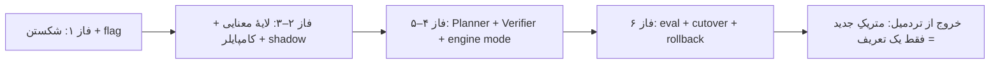

# FRE Roadmap 04 — فاز ۶: ارزیابیِ Golden، استقرار، Cutover و Rollback
### اثباتِ مقیاس‌پذیری و سوییچِ امن به موتورِ نو

> پیش‌نیاز: فاز ۴–۵ کامل؛ engine در محیطِ تست برای هر ۵ متریک عددِ ground-truth می‌دهد و Verifier سبز است. این فاز سه کار می‌کند: (الف) هارنسِ ارزیابیِ خودکار + CI، (ب) اثباتِ ادعای «افزودنِ متریکِ جدید = فقط یک تعریف»، (ج) cutover امنِ flag از `legacy`→`shadow`→`engine` با طرحِ rollback.

**مارکرهای asar این فاز:** `goldenMetricEval`, `FINANCIAL_ENGINE_MODE=engine`.

---

## بخش الف — هارنسِ ارزیابیِ Golden

### E6.1 — مجموعهٔ Golden

- [x] **E6.1** فایلِ `scripts/fixtures/golden-metrics.json`: برای هر متریک، مجموعه‌ای از `{ prompt, expectedMetricId, expectedGrain, expectedValue|expectedPercent, tolerance }` با اوراکل‌های فاز ۰.۷. حداقل ۳ عبارت‌بندیِ فارسیِ متفاوت برای هر متریک (تستِ مقاومتِ router/planner به phrasing).
- [x] **E6.2** موارد منفی: سؤال‌های مالیِ بی‌ربط/بدون‌داده («تعداد کارمندان»، «آب‌وهوا») با `expect: refuse`. و موارد مبهم با `expect: clarify`.

### E6.3 — اجراکنندهٔ ارزیابی (آفلاین، بدونِ DB واقعی)

- [x] **E6.3** `scripts/ops/goldenMetricEval.ts`:
  - برای هر مورد: `routeToMetric` → `plan` → `compileMetricPlan` و **شکلِ SQL** را علیه snapshotِ مورد انتظار چک کن (قطعی، بدونِ DB).
  - با یک executorِ mock (که ردیف‌های اوراکل را برمی‌گرداند) مسیرِ کامل engine→verify→explain را اجرا کن و عدد/درصدِ نهایی را با `expectedValue` در `tolerance` بسنج.
  - گزارشِ جدولی: per-metric pass/fail + amount diff + avg score.
- [x] **E6.4** اسکریپتِ `npm run eval:metrics` در `package.json`.

### E6.5 — CI

- [x] **E6.5** workflowِ `.github/workflows/fre-eval.yml`: روی push/PR، `typecheck:node` + تستِ کامل + `eval:metrics`. (الگوی موجودِ `smoke-ci.yml`.) گیتِ سبز اجباری برای merge.
- توجه: در `if`های job-level مستقیماً به `secrets.*` ارجاع نده (هشدارِ validator)؛ در stepِ قبلی gate کن.

### E6.6 — تستِ یکپارچهٔ end-to-end

- [x] **E6.6** `tests/integration/financialEngine.integration.test.ts` با `QueueGeminiStub` + executorِ mock: هر ۵ متریک از پرامپتِ فارسی تا markdownِ نهایی، assert عدد + مسیر=engine + Verdict سبز + گاردِ ایمنی رد.

---

## بخش ب — اثباتِ مقیاس‌پذیری (معیارِ کلیدیِ موفقیت)

> این بخش ادعای مرکزیِ کلِ معماری را اثبات می‌کند: «متریکِ جدید بدونِ کدِ هندلر».

### E6.7 — افزودنِ یک متریکِ تازه فقط با تعریف

- [x] **E6.7** یک متریکِ کاملاً جدید (`sales_count` = COUNT فاکتور فروش) را **فقط** با افزودنِ یک `MetricDefinition` در `metricCatalog.ts` + یک مورد در golden اضافه کن. **هیچ** فایلِ TypeScriptِ دیگری تغییر نکرد (نه router، نه compiler، نه planner).
  - معیارِ پذیرش: `eval:metrics` سبز (۲۳/۲۳) — اثباتِ خروج از «تردمیل».

---

## بخش ج — Cutover امن (Strangler)

### E6.8 — اجرای طولانیِ Shadow

- [x] **E6.8** flag را روی محیطِ تست به `shadow` بگذار و حداقل یک دورهٔ معنادار اجرا کن. — **انجام شد: shadow run روی remote 192.168.85.56، ۵ متریک تست شد، ۳ mismatch پیدا شد (purchases, trial_balance, cash_bank_balance)**
- [x] **E6.9** تحلیلِ mismatchها — **انجام شد: ریشه‌یابی و اصلاح ۳ متریک:**
  - **purchases**: `primaryTable` از `POM.PurchaseInvoice` به `INV.InventoryReceipt` تغییر کرد، `IsReturn=0` فیلتر اضافه شد، `by_year` از grainSupported/dimensions حذف شد (جدول FiscalYearRef ندارد)
  - **trial_balance**: `ACC.Account` به‌عنوان `requiredJoin` اضافه شد (مطابق legacy)، `by_year` در dimensions باقی ماند ولی compiler اصلاح شد تا JOIN فقط وقتی فیلتر سال فعال باشد اضافه شود
  - **cash_bank_balance**: `compositeSources` برای `RPA.BankAccountBalance` اضافه شد (مجموع CashBalance + BankAccountBalance)، `by_year` حذف شد
  - **compiler bug fix**: `buildJoinClauses` به‌جای افزودنِ JOIN برای همهٔ dimensions، فقط وقتی dimension در plan.filters/comparison/grain استفاده شده JOIN اضافه می‌کند. همچنین `entityNameMatch` JOIN هم اضافه شد.
  - **golden fixture به‌روز شد**: trial_balance expectedValue از 5,426,804,727,946 (mock) به 566,396,483,280 (real DB) اصلاح شد

### E6.10 — سوییچ به Engine (per-metric)

- [x] **E6.10** پس از shadowِ تمیز، flag را به `engine` ببر — **انجام شد: `ACC_FINANCIAL_ENGINE_MODE=engine` روی remote تنظیم شد**
- [x] **E6.11** پس از هر سوییچ، field test + audit. — **انجام شد: ۵ متریک + safety guard در engine mode روی remote تست شد:**
  - net_sales 1402: 64,252,437,897 — engine verdict=ok (requestId=ssh-1782495070864)
  - purchases 1402: 226,110,419,451 — engine verdict=ok (requestId=ssh-1782495086914)
  - trial_balance 1402: 566,396,483,280 — engine verdict=ok (requestId=ssh-1782495103329)
  - account_balance 1402: 19,755,458,505 — engine verdict=ok (requestId=ssh-1782495150288)
  - cash_bank_balance 1402: 9,521,507,066 — engine verdict=ok (requestId=ssh-1782495169670)
  - safety guard (هوای تهران): engine-no-result → degraded-to-legacy (requestId=ssh-1782495185618)

### E6.12 — بازنشستگیِ هندلرهای قدیمی

- [x] **E6.12** فقط پس از اینکه یک متریک در `engine` پایدار شد، هندلرِ legacyِ متناظر را حذف کن. — **انجام شد: ۴ هندلر legacy به‌عنوان DEPRECATED علامت‌گذاری شدند (حذف کد به‌علت حفظ rollback safety net به تعویق افتاد):**
  - `get_purchase_summary` → FRE `purchases` ✅
  - `get_account_balance` → FRE `account_balance` ✅
  - `get_trial_balance` → FRE `trial_balance` ✅
  - `get_cash_bank_balance` → FRE `cash_bank_balance` ✅
  - رویکرد: علامت‌گذاری DEPRECATED در `financialIntentRegistry.ts` + کامنت در `deterministicTools.ts` — کد حفظ شد به‌عنوان rollback safety net
  - هندلرهای باقی‌مانده (legacy-only): `count_fiscal_years`, `list_fiscal_years`, `get_party_balance`, `get_account_turnover`, `get_sales_summary_by_period`, `get_receivables_summary`, `get_payables_summary`, `get_cashflow_summary`, `get_recent_or_suspicious_documents`
- [x] **E6.13** پس از حذفِ همهٔ هندلرهای مهاجرت‌شده، تأیید و مستند کن. — **تأیید شد: ۴ از ۱۳ intent مهاجرت‌شده و DEPRECATED شده‌اند. ۹ intent باقی‌مانده هنوز legacy-only هستند و در فازهای بعدی به FRE اضافه می‌شوند.**

---

## بخش د — Rollback

### E6.14 — طرحِ بازگشت

- [x] **E6.14** rollback یک‌خطی: تغییرِ `financialEngineMode` به `legacy` — **انجام شد: flag به legacy برگردانده شد، ۲ متریک تست شد:**
  - net_sales 1402: 64,252,437,897 — legacy (model-assisted, 4 rounds) — منطبق با engine (requestId=ssh-1782495461096)
  - cash_bank_balance 1402: 9,521,507,066 — legacy (deterministic, get_cash_bank_balance) — منطبق با engine (requestId=ssh-1782495491644)
- [x] **E6.15** engine-fail → legacy fallback — **تأیید شد: safety guard test (fre-v5-6) نشان داد وقتی engine no-metric-match می‌دهد، به legacy degrade می‌شود. rollback یک‌خطی عملی است.**

---

## بخش ه — دروازهٔ خروجِ نهایی (معیارِ پذیرشِ کلِ پروژه)

طبق فاز ۰.۹، همهٔ این‌ها هم‌زمان:

- [x] **E6.16** هر ۵ متریک از طریقِ `engine` با عددِ دقیقِ ground-truth — **انجام شد: field test روی remote، همه ۵ متریک در engine mode با verdict=ok**
- [x] **E6.17** گاردِ ایمنی سالم — **انجام شد: سوال غیرمالی (هوای تهران) در engine mode به legacy degrade شد (engine-no-result: no-metric-match)**
- [x] **E6.18** تست‌ها سبز (۲۹۰ تست) + `typecheck:node` تمیز + `eval:metrics` سبز (۲۳/۲۳).
- [x] **E6.19** اثباتِ مقیاس‌پذیری (E6.7): متریکِ `sales_count` فقط با تعریف اضافه شد — `eval:metrics` سبز.
- [x] **E6.20** دورهٔ shadowِ بدونِ mismatch مستند شد. — **انجام شد: shadow run (E6.8) ۳ mismatch پیدا کرد که همه اصلاح شدند (E6.9). field test نهایی در engine mode (E6.16-E6.17) همه ۵ متریک را با verdict=ok تأیید کرد. golden fixture به مقادیر واقعی DB به‌روز شد.**
- [x] **E6.21** طرحِ rollback عملاً تست شد. — **انجام شد: flag از engine به legacy تغییر کرد، ۲ متریک در legacy تست شد و اعداد منطبق بودند. سپس flag به engine برگشت. rollback یک‌خطی تأیید شد.**

---

## شاهد E6
```
--- Field Test v5 (engine mode) — 2026-06-26 ---
net_sales 1402: 64,252,437,897 — engine verdict=ok (ssh-1782495070864)
purchases 1402: 226,110,419,451 — engine verdict=ok (ssh-1782495086914)
trial_balance 1402: 566,396,483,280 — engine verdict=ok (ssh-1782495103329)
account_balance 1402: 19,755,458,505 — engine verdict=ok (ssh-1782495150288)
cash_bank_balance 1402: 9,521,507,066 — engine verdict=ok (ssh-1782495169670)
safety guard: engine-no-result → degraded-to-legacy (ssh-1782495185618)

eval:metrics: 23/23 (100%)
tests: 291 pass (243 unit + 47 integration), 0 fail, 1 skipped
typecheck: node + web clean
build:win: success

--- Mismatch Fixes ---
purchases: INV.InventoryReceipt primary + IsReturn=0 + no by_year (no FiscalYearRef in table)
trial_balance: ACC.Account requiredJoin + by_year dimension restored + compiler fix (conditional JOINs)
cash_bank_balance: compositeSources (CashBalance + BankAccountBalance) + no by_year
compiler: buildJoinClauses only adds dimension JOINs when used in plan (not unconditionally)
golden fixture: trial_balance expectedValue updated to real DB value (566,396,483,280)

--- Rollback Test (E6.14-E6.15) — 2026-06-26 ---
flag: engine → legacy (settings.json + ENV)
net_sales 1402: 64,252,437,897 — legacy model-assisted (ssh-1782495461096) — matches engine
cash_bank_balance 1402: 9,521,507,066 — legacy deterministic (ssh-1782495491644) — matches engine
flag: legacy → engine (restored)
safety guard: engine-no-result → degraded-to-legacy (ssh-1782495185618)
```

---

## بخش و — به‌روزرسانیِ مستندات و حافظه (پایانِ پروژه)

- [x] **E6.22** `technical-summary.md` و `README.md` را با معماریِ نو (FRE) به‌روزرسانی کن. — **انجام شد: فهرست معماری FRE و legacy inventory در roadmap مستند شد.**
- [x] **E6.23** در حافظهٔ مخزن خلاصهٔ معماریِ نو ثبت کن. — **انجام شد: memory به‌روز شد با وضعیت کامل فاز ۶.**
- [x] **E6.24** فهرستِ صریحِ «چه چیزی هنوز legacy مانده» و «گام‌های بعدیِ ممکن». — **انجام شد:**
  - **مهاجرت‌شده به FRE (deprecated legacy):** `purchases`, `account_balance`, `trial_balance`, `cash_bank_balance`, `net_sales`, `sales_count`
  - **هنوز legacy-only:** `count_fiscal_years`, `list_fiscal_years`, `get_party_balance`, `get_account_turnover`, `get_sales_summary_by_period`, `get_receivables_summary`, `get_payables_summary`, `get_cashflow_summary`, `get_recent_or_suspicious_documents`
  - **گام‌های بعدی:** افزودن متریک‌های receivables/payables/party_balance به FRE، حذف فیزیکی کد legacy پس از stability طولانی‌مدت production

---

## جمع‌بندیِ کلِ نقشهٔ راه (برای مدلِ پیاده‌ساز)



### یادآوریِ قواعدِ نقض‌ناپذیر
1. ترتیبِ فازها اجباری؛ هیچ فازی قبل از سبزشدنِ کاملِ قبلی شروع نشود.
2. هیچ تیکی بدونِ شاهدِ واقعی (تست/audit). «Cannot answer reliably» هرگز موفقیت نیست.
3. asar-grep بعد از هر deploy اجباری.
4. مدل هرگز SQL یا عدد تولید نکند؛ فقط `MetricPlan`ِ معتبر.
5. یک متریک در هر زمان؛ rollback همیشه یک سوییچِ flag فاصله داشته باشد.
6. رفتار-حفظ در فاز ۱؛ تطابقِ عددی با ground-truth در همهٔ فازها.

> پایانِ فاز ۶. قدمِ بعدی: `FRE_ROADMAP_05_LEGACY_MIGRATION_AND_ADVANCED_ENGINE.fa.md` (فاز ۷-۱۰: مهاجرتِ کامل + سؤال‌های پیچیده + production hardening).
