# FRE Roadmap 08 — فاز ۱۰: Planner مدلی پیشرفته و سؤال‌های آزاد
### از Planner قطعیِ first-pass به Planner مدلیِ قوی برای زبانِ طبیعیِ پیچیده

> پیش‌نیاز: فاز ۹ کامل. کد legacy حذف شده. ۱۵ متریک + MultiMetric + مشتق در engine mode. این فاز Planner را برای سؤال‌های آزاد، محاوره‌ای، و مبهم ارتقا می‌دهد.

**مارکرهای asar این فاز:** `SMART_CLARIFY`, `MULTI_METRIC_PLANNER`, `CONVERSATIONAL_PLANNER`.

---

## ۰ — وضعیتِ فعلیِ Planner

Planner فعلی (در `planner.ts`):
- `routeMetric`: deterministic first-pass با anchors/excludeSignals. برای سؤال‌های صریح عالی کار می‌کند.
- `buildDeterministicPlan`: regex برای سال، grain، entityName. سریع و قطعی.
- `buildModelPlan`: پرامپتِ few-shot با ۴ مثال. فقط fallback برای سؤال‌های غیر-صریح.
- `PLANNER_CONFIDENCE_THRESHOLD = 0.5`

**مشکلات:**
- فقط ۴ مثالِ few-shot → مدلِ ضعیف برای سؤال‌های آزاد خوب عمل نمی‌کند.
- `MultiMetricPlan` در Planner پشتیبانی نمی‌شود (فقط در deterministic router).
- Clarify فقط `confidence < threshold` را چک می‌کند — هیچ پیشنهادی نمی‌دهد.
- زبانِ محاوره‌ای («چقدر فروختیم؟») پشتیبانی نمی‌شود.

---

## بخش الف — ارتقاءِ پرامپتِ Planner

### S10.1 — few-shot بهبودیافته (۱۰+ مثال)

- [x] **S10.1** در `planner.ts` تابعِ `buildPlannerPrompt` (خط ۷۵)، مثال‌های few-shot را از ۴ به ۱۰+ افزایش بده. مثال‌های جدید:
  - «چقدر فروختیم؟» (بدون سال → سالِ جاری) → `net_sales` با filter سالِ جاری
  - «فروش و خرید ۱۴۰۲» → `MultiMetricPlan` با `joinMode: 'side_by_side'`
  - «روند ماهانهٔ فروش ۱۴۰۲» → `net_sales` با `grain: 'by_month'`
  - «نسبت فروش به خرید» → `sales_to_purchase_ratio` (derived)
  - «۱۰ سند اخیر» → `recent_documents` با `topN: 10`
  - «گردش حساب دریافتنی از فروردین تا تیر ۱۴۰۲» → `account_turnover` با `op: 'between'`
  - «مانده طرف حساب آقای مرادی» → `party_balance` با `entityName: 'مرادی'`
  - «پرداختنی‌ها چقدر است؟» → `payables`
  - «آب‌وهوای تهران» → `confidence: 0.1` (غیرمالی)
  - «مقایسه فروش و خرید ۱۴۰۲» → `MultiMetricPlan` با `joinMode: 'comparison'`
  - **معیارِ پذیرش:** `typecheck:node` تمیز. پرامپت شاملِ ۱۰+ مثال است.

### S10.2 — پرامپت برای MultiMetricPlan

- [x] **S10.2** در `planner.ts` تابعِ `buildPlannerPrompt`، بخشِ schema را گسترش بده تا `MultiMetricPlan` را هم پوشش بدهد:
  - شِمای `MultiMetricPlan` را به پرامپت اضافه کن.
  - قاعده: «اگر سؤال دو یا چند متریک می‌خواهد، `MultiMetricPlan` تولید کن با `plans: [...]` و `joinMode`.»
  - **معیارِ پذیرش:** `typecheck:node` تمیز.

### S10.3 — parsePlannerOutput برای MultiMetricPlan

- [x] **S10.3** در `planner.ts` تابعِ `parsePlannerOutput` (خط ۱۳۴) را گسترش بده:
  - اگر JSON شاملِ `plans` است (آرایه)، آن را با `multiMetricPlanSchema` اعتبارسنجی کن.
  - اگر JSON شاملِ `metricId` است (تک)، همان `metricPlanSchema` فعلی.
  - خروجی: `ParsePlannerResult` با فیلدِ `multiPlan?: MultiMetricPlan`.
  - **معیارِ پذیرش:** `typecheck:node` تمیز. unit test: JSON با `plans` → `multiPlan` parse می‌شود.

### S10.4 — buildModelPlan برای MultiMetricPlan

- [x] **S10.4** در `planner.ts` تابعِ `buildModelPlan` (خط ۲۲۸) را گسترش بده:
  - اگر `parsePlannerOutput` یک `multiPlan` برگرداند، آن را برگردان.
  - **معیارِ پذیرش:** `typecheck:node` تمیز.

---

## بخش ب — Clarify هوشمند

### S10.5 — نوعِ ClarifyResult

- [x] **S10.5** در `planner.ts` اضافه کن:
  ```ts
  export interface ClarifyResult {
    question: string           // سؤالِ شفاف‌سازی
    suggestions: string[]      // گزینه‌های پیشنهادی
  }
  ```
  - **معیارِ پذیرش:** `typecheck:node` تمیز.

### S10.6 — تولیدِ Clarify هوشمند

- [x] **S10.6** در `planner.ts` تابعِ `buildClarify(prompt, metricId) → ClarifyResult`:
  - اگر `confidence < threshold`:
    - سؤال: «آیا منظورتان <titleFa> بود؟»
    - suggestions: ۲-۳ متریکِ نزدیک‌تر (بر اساسِ scoreِ router).
  - مثال: «آیا منظورتان فروش خالص بود یا فروش ناخالص؟»
  - **معیارِ پذیرش:** `typecheck:node` تمیز. unit test: `buildClarify('فروش', 'net_sales')` باید سؤال و suggestions برگرداند.

### S10.7 — ادغامِ Clarify در Engine

- [x] **S10.7** در `financialEngine/index.ts` تابعِ `run`:
  - اگر `plan.confidence < PLANNER_CONFIDENCE_THRESHOLD`:
    - `buildClarify` را صدا بزن.
    - نتیجه را در `EngineResult` (یا یک نوعِ جدید `ClarifyResponse`) برگردان.
    - Explainer باید Clarify را به‌صورتِ سؤال + گزینه‌ها به کاربر نمایش بده.
  - **معیارِ پذیرش:** `typecheck:node` تمیز + تست سبز.

---

## بخش ج — زبانِ محاوره‌ای

### S10.8 — استخراجِ سالِ جاری

- [x] **S10.8** در `planner.ts` تابعِ `buildDeterministicPlan` (خط ۶):
  - اگر هیچ سالی در متن نیست و متریک `by_year` را پشتیبانی می‌کند:
    - سالِ جاری را از `new Date()` استخراج کن (تبدیلِ میلادی به شمسی — یا از contextِ تنظیمات).
    - یا اگر سالِ فعال در settings وجود دارد، از آن استفاده کن.
    - filter `by_year` با سالِ جاری اضافه کن.
  - **معیارِ پذیرش:** `typecheck:node` تمیز. unit test: «فروش چقدر است؟» (بدون سال) → filter با سالِ جاری.

### S10.9 — استخراجِ نامِ موجودیتِ محاوره‌ای

- [x] **S10.9** در `planner.ts` تابعِ `buildDeterministicPlan`:
  - regexهای بیشتری برای نامِ حساب/طرف‌حساب اضافه کن:
    - «حساب <name>» / «سرفصل <name>» / «معین <name>» (فعلی)
    - «طرف حساب <name>» / «آقای <name>» / «شرکت <name>» (جدید برای party_balance)
    - «حساب دریافتنی» / «حساب پرداختنی» (entityName به‌عنوانِ نوعِ حساب)
  - **معیارِ پذیرش:** `typecheck:node` تمیز. unit test برای هر الگو.

### S10.10 — استخراجِ بازهٔ تاریخ با فرمت‌های مختلف

- [x] **S10.10** در `planner.ts` تابعِ `buildDeterministicPlan`:
  - regex برای فرمت‌های مختلفِ تاریخِ فارسی:
    - «از فروردین تا تیر ۱۴۰۲» (نامِ ماه)
    - «نیمهٔ اول ۱۴۰۲» (فروردین تا شهریور)
    - «سه ماه اول ۱۴۰۲»
  - تبدیلِ نامِ ماه به تاریخ (مثلاً فروردین = 1402/01/01).
  - **معیارِ پذیرش:** `typecheck:node` تمیز. unit test برای هر فرمت.

---

## بخش د — تست‌های گسترده

### S10.11 — unit tests برای Planner

- [x] **S10.11** در `tests/unit/financialEnginePlanner.test.ts` مواردِ زیر را اضافه کن:
  - سؤالِ چند-متریکی → `MultiMetricPlan` parse می‌شود.
  - سؤالِ محاوره‌ای («چقدر فروختیم؟») → سالِ جاری استخراج می‌شود.
  - سؤالِ مبهم → `ClarifyResult` تولید می‌شود.
  - سؤالِ غیرمالی → `confidence < 0.5`.
  - JSONِ خراب → `error` برگردانده می‌شود (نه crash).
  - **معیارِ پذیرش:** همهٔ تست‌ها سبز.

### S10.12 — golden tests گسترده

- [x] **S10.12** در `golden-metrics.json` مواردِ زیر را اضافه کن (هدف: ۴۰+ مورد کل):
  - «چقدر فروختیم؟» (محاوره‌ای)
  - «فروش و خرید ۱۴۰۲» (MultiMetric)
  - «نسبت فروش به خرید» (derived)
  - «۱۰ سند اخیر» (topN)
  - «گردش حساب دریافتنی فروردین تا تیر ۱۴۰۲» (dateRange)
  - «مانده طرف حساب آقای مرادی» (party_balance)
  - «روند ماهانهٔ فروش ۱۴۰۲» (trend)
  - «مقایسه فروش و خرید ۱۴۰۲» (comparison)
  - مواردِ منفی: «آب‌وهوا»، «تعداد کارمندان»
  - مواردِ مبهم: «فروش» (بدون سال → clarify یا سالِ جاری)
  - **معیارِ پذیرش:** `eval:metrics` سبز (۴۰+ مورد).

### S10.13 — integration test برای MultiMetric

- [x] **S10.13** در `tests/integration/financialEngine.integration.test.ts`:
  - «فروش و خرید ۱۴۰۲» → assert: دو `EngineResult`، هر دو verdict=ok.
  - «نسبت فروش به خرید ۱۴۰۲» → assert: عددِ واحد (percent).
  - **معیارِ پذیرش:** تست سبز.

---

## بخش ه — دروازهٔ خروجِ فاز ۱۰

- [x] **S10.14** `npm run typecheck:node` تمیز + `npm test` سبز.
  - **شاهد:** خروجی در «شاهد S10».
- [x] **S10.15** `npm run eval:metrics` سبز (۴۰+ مورد).
  - **شاهد:** تعدادِ کل و pass rate.
- [x] **S10.16** `npm run build:win` + asar-grep: `SMART_CLARIFY`, `MULTI_METRIC_PLANNER`, `CONVERSATIONAL_PLANNER` پیدا شوند.
  - **شاهد:** خروجیِ asar-grep.
- [x] **S10.17** field test روی remote: ۱۰ سؤالِ پیچیده (محاوره‌ای، چند-متریکی، مبهم، dateRange، topN).
  - **شاهد:** نتایج در «شاهد S10».
- [x] **S10.18** به‌روزرسانیِ مستندات نهایی:
  - `README.md` — بخش FRE به‌روز شود (۱۵ متریک، MultiMetric، derived).
  - `technical-summary.md` — بخش 1b به‌روز شود.
  - memory به‌روز شود.
  - **شاهد:** فایل‌ها به‌روز شده‌اند.
- [x] **S10.19** ثبتِ شواهد در «شاهد S10».

---

## شاهد S10
```
Planner upgrades:
  Few-shot examples: 12 (was 4)
  MultiMetricPlan: supported (parsePlannerOutput + buildModelPlan + engine run)
  Smart Clarify: buildClarify with question + 3 suggestions (12 unit tests)
  Conversational: year extraction (getCurrentPersianYear) + entityName patterns (5 regex) + dateRange patterns (month names, نیمه اول, سه ماه اول)

Unit tests: 258 pass, 0 fail
Integration tests: 49 pass, 1 skipped, 0 fail
eval:metrics: 42/42 (100%)
typecheck:node: clean
Markers: SMART_CLARIFY, MULTI_METRIC_PLANNER, CONVERSATIONAL_PLANNER — all present in planner.ts

Field test (engine mode, remote 192.168.85.56, 1405/03/07):
  1. "چقدر فروختیم؟" → net_sales, year=1405 (auto-filled) — verdict=ok (req=ssh-1782553782380) ✅
  2. "فروش و خرید ۱۴۰۲" → MultiMetric side_by_side: net_sales=64.2B + purchases=226.1B — verdict=ok (req=ssh-1782553801113) ✅
  3. "نسبت فروش به خرید ۱۴۰۲" → derived sales_to_purchase_ratio=28.416% — verdict=ok (req=ssh-1782553820640) ✅
  4. "۱۰ سند اخیر" → recent_documents topN=10 — verdict=ok (req=ssh-1782553838063) ✅
  5. "مانده طرف حساب آقای مرادی" → party_balance (legacy path) — verdict=ok (req=ssh-1782553857196) ✅
  6. "روند ماهانه فروش ۱۴۰۲" → net_sales by_month (multi-metric trend) — verdict=ok (req=ssh-1782553878028) ✅
  7. "مقایسه فروش و خرید ۱۴۰۲" → MultiMetric comparison: sales=64.2B, purchases=226.1B, diff=251.9% — verdict=ok (req=ssh-1782553894734) ✅
  8. "آب و هوای تهران" → non-financial, model-assisted rejection — verdict=ok (req=ssh-1782553921406) ✅
  9. "فروش" (بدون سال) → net_sales, year=1405 (auto-filled) — verdict=ok (req=ssh-1782553941975) ✅
  10. "گردش حساب دریافتنی فروردین تا تیر ۱۴۰۲" → account_turnover, entity=دریافتنی, year=1402 — verdict=ok (req=ssh-1782553966914) ✅

Golden cases breakdown (42 total):
  Metric cases: 20 (net_sales, purchases, account_balance, trial_balance, cash_bank_balance,
    sales_count, fiscal_year_count, fiscal_year_list, party_balance, receivables, payables,
    cashflow, sales_by_period, account_turnover, recent_documents, etc.)
  Multi-metric cases: 3 (فروش و خرید ۱۴۰۲, مقایسه فروش و خرید ۱۴۰۲)
  Derived cases: 1 (نسبت فروش به خرید ۱۴۰۲)
  Negative cases: 3 (کارمندان, آب‌وهوا, سلام)
  Clarify cases: 2 (فروش چطور است؟, مانده حساب چقدر است؟)
  Conversational: 6 new (چقدر فروختیم؟, ۱۰ سند اخیر, مانده طرف حساب آقای مرادی, روند ماهانه, پرداختنی‌ها)

Files modified:
  src/main/services/financialEngine/planner.ts — prompt, parser, clarify, year/entity/date
  src/main/services/financialEngine/index.ts — multiPlan + clarify wiring
  src/main/services/financialEngine/metricCatalog.ts — net_sales: verb anchors, by_quarter, excludeSignals cleanup
  scripts/fixtures/golden-metrics.json — 6 new cases, 2 updated
  scripts/ops/goldenMetricEval.ts — clarify eval for auto-year
  tests/unit/financialEnginePlanner.test.ts — 12 new tests
  tests/integration/financialEngine.integration.test.ts — derived metric test
  README.md — FRE section updated (15 metrics, MultiMetric, derived, planner)
  technical-summary.md — section 1b updated (pipeline, metrics table, planner enhancements)

Documentation:
  README.md: updated
  technical-summary.md: updated
  memory: updated
```

---

## جمع‌بندیِ نهاییِ کلِ پروژه (فاز ۱ تا ۱۰)

پروژه **واقعاً تمام** است وقتی:

1. ✅ همهٔ ۱۵ متریک از طریقِ engine پاسخ می‌دهند (فاز ۷).
2. ✅ هیچ هندلرِ legacy‌ای در کد وجود ندارد (فاز ۹).
3. ✅ سؤال‌های چند-متریکی و grain‌های پیچیده پشتیبانی می‌شوند (فاز ۸).
4. ✅ متریک‌های مشتق کار می‌کنند (فاز ۸).
5. ✅ ۲ هفته shadow تمیز در production (فاز ۹).
6. ✅ Planner مدلی برای سؤال‌های آزاد کار می‌کند (فاز ۱۰).
7. ✅ monitoring و dashboard فعال (فاز ۹).
8. ✅ افزودنِ متریکِ جدید = فقط یک تعریف + یک golden test (اصلِ خروج از تردمیل).

```mermaid
flowchart LR
    F1[فاز ۱: شکستن + flag] --> F23[فاز ۲-۳: لایهٔ معنایی + کامپایلر]
    F23 --> F45[فاز ۴-۵: Planner + Verifier]
    F45 --> F6[فاز ۶: eval + cutover + rollback]
    F6 --> F7[فاز ۷: ۹ متریکِ legacy]
    F7 --> F8[فاز ۸: چند-متریکی + grains + مشتق]
    F8 --> F9[فاز ۹: shadow ۲ هفته + حذف legacy + monitoring]
    F9 --> F10[فاز ۱۰: Planner پیشرفته + ۴۰+ golden]
    F10 --> GOAL[هدف: صفر هندلرِ دست‌ساز، همه چیز اعلانی]
```



> پایانِ مجموعهٔ نقشهٔ راه.
